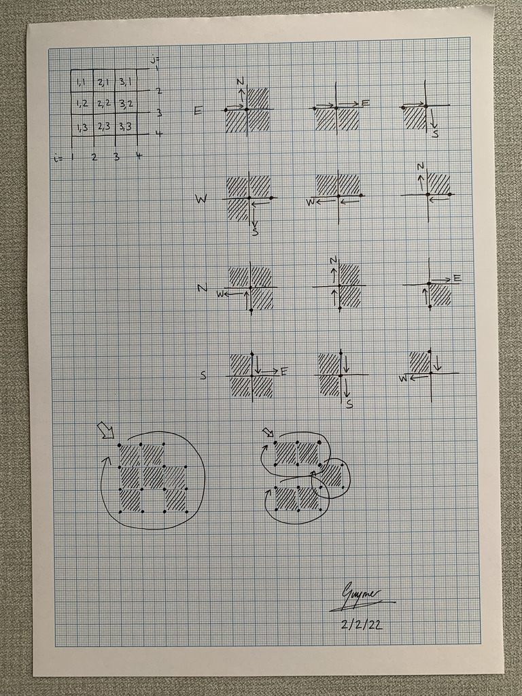

# Vectorise GLOBE Dataset (VGD)

This collection of FORTRAN programs and Python 3.x scripts downloads the [GLOBE](https://www.ngdc.noaa.gov/mgg/topo/globe.html) dataset and (eventually) creates a collection of GeoJSON files containing Polygons that describe Earth's elevation.

## Workflow

1. Download the [GLOBE](https://www.ngdc.noaa.gov/mgg/topo/globe.html) dataset (by running [downloadGLOBE.py](downloadGLOBE.py))
2. Convert the ZIP file of the [GLOBE](https://www.ngdc.noaa.gov/mgg/topo/globe.html) dataset to a BIN file (by running [convertZIPtoBIN.py](convertZIPtoBIN.py))
3. Compile the FORTRAN programs (by running [Makefile](src/Makefile))
4. Downscale the [GLOBE](https://www.ngdc.noaa.gov/mgg/topo/globe.html) dataset to different resolutions (by running [downscale](src/downscale.F90))
5. Convert the [GLOBE](https://www.ngdc.noaa.gov/mgg/topo/globe.html) dataset(s) to PNG files (by running [convertBINtoPNG.py](convertBINtoPNG.py))
6. Vectorise the [GLOBE](https://www.ngdc.noaa.gov/mgg/topo/globe.html) dataset(s) to CSV files (by running [vectorise](src/vectorise.F90))
7. Convert the masks to PNG files (by running [convertPGMtoPNG.py](convertPGMtoPNG.py))
8. Convert the vectors to GeoJSON files (by running [convertCSVtoGeoJSON.py](convertCSVtoGeoJSON.py))

## Dependencies

VGD requires the following Python modules to be installed and available in your `PYTHONPATH`.

* [geojson](https://pypi.org/project/geojson/)
* [numpy](https://pypi.org/project/numpy/)
* [PIL](https://pypi.org/project/Pillow/)
* [pyguymer3](https://github.com/Guymer/PyGuymer3)
* [shapely](https://pypi.org/project/Shapely/)

## Pathfinding Logic

When FORTRAN loads up the binary data of elevation, the origin is in the top-left corner of Earth. The pathfinding algorithm then follows this logic (recognising that there are `nx * ny` pixels and `(nx + 1) * (ny + 1)` pixel edges):

